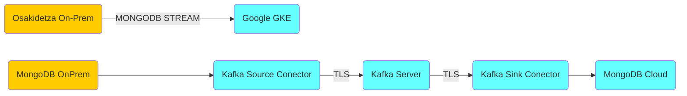
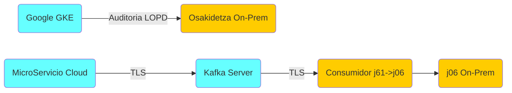

# Kafka eHodei: Acceso

v 1.0 2021/07/15 sergio-perez@ejie.eus  Primera versión

[TOC]

## Objetivo

Seguridad en el acceso  asociado al servicio kafka en los sistemas  eHodei en Cloud, con alcance:

-  Publicación del servicio

- Acceso

- Cerfificados y secretos

  

## Publicación Servicio

En la fase inicial, el servicio kafka está expuesto solamente internamente en kubernetes, con una segmentación en varios niveles:

- Cluster y direccionamiento productivo dedicado

- Namespaces (backend-sandbox, j61-sandbox...) y segmentación de red (network policies)

  

El servicio kafka se publica  en kubernetes  con dos niveles de exposición :

- **Interno a kubernetes** (intra-k8s): acceso admin, mongodb streaming y microservicios cloud
- **Externo a kubernetes** (extra-k8s): servicio on-prem j61 para auditorioa LOPD (J06)  **[PENDIENTE]**


#### Interno a Kubernetes

La publicación interna de kafka se limita a  direccionamiento y nomenclatura de servicios interna:

| Entorno | Namespace | Publicación de servicio     | Gitlab  | Jenkins |
| ------- | --------- | --------------------------- | ------- | ------ |
| NOP/LAB | kafka-canary | kafka01nop-j61-kafka-bootstrap.kafka-canary.svc.cluster.local | [j61-kafka-canary](https://src.alm01.itbatera.euskadi.eus/itbatera/gcp/gcp-project-templates/unix-gcp-templates/-/tree/master/j61-kafka-canary) | [31-deploy-canary](https://builds.alm01.itbatera.euskadi.eus/job/platform/job/unix/job/j61-kafka/job/31-deploy-canary/) |
| NOP/PRE | kafka-sandbox | kafka01nop-j61-kafka-bootstrap.kafka-sandbox.svc.cluster.local | [j61-kafka-sandbox](https://src.alm01.itbatera.euskadi.eus/itbatera/gcp/gcp-project-templates/unix-gcp-templates/-/tree/master/j61-kafka-sandbox)    | [33-deploy-sandbox](https://builds.alm01.itbatera.euskadi.eus/job/platform/job/unix/job/j61-kafka/job/33-deploy-sandbox/) |
| PRO     | kafka-pro     | kafka01pro-j61-kafka-bootstrap.kafka-pro.svc.cluster.local   | [j61-kafka-pro](https://src.alm01.itbatera.euskadi.eus/itbatera/gcp/gcp-project-templates/unix-gcp-templates/-/tree/master/j61-kafka-pro)   | [34-deploy-pro](https://builds.alm01.itbatera.euskadi.eus/job/platform/job/unix/job/j61-kafka/job/34-deploy-pro/)  |

La publicación interna a kubernetes se define a través de los listeners dentro de la definición del cluster kafka como código en [Gitlab](https://src.alm01.itbatera.euskadi.eus/itbatera/gcp/gcp-project-templates/unix-gcp-templates/) . 


**Validación previa**

Desde  un pod de aplicación  se puede validar la publicación y conectividad:

````
[gke01nop]# kubectl exec j61-app-frontend-68c5d79-rjcfm -- nc -vz kafka01nop-j61-kafka-bootstrap.kafka-sandbox.svc.cluster.local 9093

kafka01nop-j61-kafka-bootstrap.kafka-sandbox.svc.cluster.local (10.121.110.213:9093) open
````

Idem para conectores mongodb kafka:

````
[gke01nop]$ kubectl exec -it mongodb-connect-community-connect-6d75fc9597-rf474  -- nc -vz kafka01nop-j61-kafka-bootstrap.kafka-sandbox.svc.cluster.local 9093
Ncat: Version 7.50 ( https://nmap.org/ncat )
Ncat: Connected to 10.121.110.251:9093.
Ncat: 0 bytes sent, 0 bytes received in 0.14 seconds.

````

#### Externo a kubernetes

La publicación externa a Kubernetes, requiere la creación de elementos adicionales (ingress, nodeport, load balancer...), está **pendiente** de definición a nivel de [Gitlab](https://src.alm01.itbatera.euskadi.eus/itbatera/gcp/gcp-project-templates/unix-gcp-templates/), despliegue mediante pipeline jenkins, y la definición de elementos extras de seguridad (IP Access List).

 

## Acceso 

Acceso Kafka multinivel:


| Nivel           | Exposición | Autenticación       | Identidad                | Autorización                                                 |
| --------------- | ---------- | ------------------- | ------------------------ | ------------------------------------------------------------ |
| Consola GCP[^1] | Internet   | OKTA MFA[^2]        | AD elkarlan              | **RBAC: CloudOps**(Admin GCP) **PlatOps**(Admin GKE[^3], cli k8s, kafka y backend) **DevOps**(Developer GKE, Metricas, Logging) |
| CI/CD[^4]       | Internet   | Gitlab/Jenkins ADFS | AD elkarlan y osakidetza | **RBAC: PlatOps**(Admin kafka y backend) **DevOps**(CI/CD  microservicios, frontend, ingress) |
| Kafka           | Interna    | local TLS           | x.509 (certificados)     | **ACL**: mongodb-connect-community, j61-auditoria            |

[^1]: GCP: Google Cloud Platform
[^2]: MFA: Multi-Factor Authentication
[^3]: GKE: Google Kubernetes Engine
[^4]: CI/CD: Continous Integration / Continous Deployment


### Acceso admin

PlatOps administra el cluster Kafka contenerizado en modo Kubernetes mediante los operadores  Kafka [Strimzi](https://strimzi.io/). Puntualmente, la administración manual es posible a través de la consola GCP y rol administrador GKE.


### Acceso aplicación

Dentro de la definición del cluster kafka como código en [Gitlab](https://src.alm01.itbatera.euskadi.eus/itbatera/gcp/gcp-project-templates/unix-gcp-templates/) se especifica un usuario de acceso para cada flujo de datos: 

- **mongodb-connect-community** : [Conectores mongodb kafka](https://src.alm01.itbatera.euskadi.eus/itbatera/gcp/gcp-project-templates/unix-gcp-templates/-/blob/master/j61-kafka-sandbox/06_user_kafka_connect.yaml)

-  **j61-auditoria**: [Auditoria LOPD de aplicación](https://src.alm01.itbatera.euskadi.eus/itbatera/gcp/gcp-project-templates/unix-gcp-templates/-/blob/master/j61-kafka-sandbox/04_kafka_user_j61.yaml) 


Los usuarios de acceso Kafka se definen con autenticación TLS  y ACLs para  control del consumo/producción de topics. El ciclo de vida del usuario y credenciales asociadas (key y certificado) se gestionan de forma automática por parte de operador kubernetes.


####  Acceso Conectores MongoDB Kafka





Para cada colección MongoDB a sincronizar, dos conectores mongodb kafka (source & sink) acceden  al servicio Kafka internamente a kubernetes  y se registran en un topic con el nombre de la colección. El conector source se registra en el topic para producir y el conector sink para consumir documentos en modo streaming.


Los conectores Mongodb Kafka se conectan a Kafka con el usuario  **mongodb-connect-community** y autenticación mutual TLS:

````
[gke01nop]$ kubectl get kafkausers mongodb-connect-community -n kafka-sandbox
NAME                        CLUSTER          AUTHENTICATION   AUTHORIZATION   READY
mongodb-connect-community   kafka01nop-j61   tls              simple          True

````


#### Acceso  Kafka  desde Aplicación




El microservicio cloud se registra al topic j61-j06-auditoria internamente a kubernetes para producir registros de auditoria. Por otro lado, el servicio j61 on-prem se registra al mismo topic desde fuera de kubernetes para consumir los registros de auditoria generados.


El microservicio cloud y la aplicación j61 On-Prem se conectan a Kafka con el usuario **usuario j61-auditoria**  y autenticación mutual TLS:

 ````
# kubectl get kafkausers j61-auditoria

NAME      CLUSTER     AUTHENTICATION  AUTHORIZATION  READY

j61-auditoria  kafka01nop-j61  tls       simple     True
 ````

#####  Microservicios Cloud  

Los microservicios ehodei/j61 se subscriben al topic  **j61-j06-auditoria**  kafka cloud para la producción de registros de auditoria de actividad en cloud. Cliente y servicio kafka están en el cloud y la integración se lleva a cabo a nivel interno del cluster kubernetes (intraK8s).

El acceso al topic **j61-j06-auditoria** por parte del usuario **j61-auditoria**  es autenticada y encriptada vía  TLS mediante certificados, gestionados por el operador kubernetes kafka a nivel de CA, despliegue y renovaciones.

#####  Aplicación  j06 OnPrem  

La aplicación j61 en weblogic OnPrem  se subscriben al topic  **j61-j06-auditoria**  en kafka cloud para el consumo de registros de auditoria de actividad y su posterior registro en colas JMS de j06 OnPrem. El cliente  on-premise se conecta  al servicio cloud, para ello el servicio kafka requiere publicación fuera de kubernetes (extrak8s) a través de VPN,


## Certificados y secretos


Para soportar la encriptación a nivel de cluster, cada componente Kafka requiere certificados de clave privada y pública. Todos los certificados de componentes son firmados por una Autoridad Certificadora(CA) interna, denominada `cluster CA`. 

De forma similar, cada aplicación cliente Kafka se conecta al mediante autenticación TLS, necesita clave privada y certificados. Una segunda CA, llamada `clients CA`, se emplea para firmar los certificados de los clientes Kafka.

Ambos  `cluster CA` y `clients CA` tiene un certificado de clave pública auto-firmado.

Los certificados CA, claves privadas, certificados (server y usuario) son generados automáticamente por el Operador de Cluster, y almacenados en secretos de Kubernetes. Todas las claves son de 2048 bits. 

Los listeners Kafka se configuran con encriptación TLS activada, y certificados auto-firmados por la  CA generada  por el operador durante el despliegue inicial del cluster. Cuando los clientes intentan conectar con un listenter securizado con dicho certificado, no confían por defecto. Es necesario configurar a nivel de cliente la clave pública de la CA con la que se firmaron los certificados de servidor.

Es necesario distribuir la clave publica a todos los clientes y activar su configuración. Por otro lado, es necesario actualizar la clave pública CA cada vez que se cambia.

Los periodos de validez de certificados CA, definido como número de días transcurridos desde la generación del certificado, se configuran en `Kafka.spec.clusterCa.validityDays` y `Kafka.spec.clientsCa.validityDays`.


````
Not Before                                     Not After
    |                                              |
    |<--------------- validityDays --------------->|
                              <--- renewalDays --->|
````

El periodo de validez para los dos certificados son  365 días. Por defecto, el operador Strimzi genera y renueva los certificados CA emitidos por `cluster CA` o `clients CA`. Los certificados proporcionados por usarios no son renovados.


El periodo de valided de los certificados CA se puede comprobar mediante el comando openssl:

````
[gke01nop]$ kubectl -n kafka-sandbox get secret kafka01nop-j61-cluster-ca-cert  -o 'jsonpath={.data.ca\.crt}' |  base64 -d | openssl x509 -subject -issuer -startdate -enddate -noout
subject= /O=io.strimzi/CN=cluster-ca v0
issuer= /O=io.strimzi/CN=cluster-ca v0
notBefore=Jul 15 09:32:11 2021 GMT
notAfter=Jul 15 09:32:11 2022 GMT
[gke01nop]$ kubectl -n kafka-sandbox get secret kafka01nop-j61-clients-ca-cert  -o 'jsonpath={.data.ca\.crt}' |  base64 -d | openssl x509 -subject -issuer -startdate -enddate -noout
subject= /O=io.strimzi/CN=clients-ca v0
issuer= /O=io.strimzi/CN=clients-ca v0
notBefore=Jul 15 09:32:13 2021 GMT
notAfter=Jul 15 09:32:13 2022 GMT
````

El comando devuelve las fechas  `notBefore` y `notAfter` date, que es el periodo de valided para cada certificado CA.


### Certificados Conectores MongoDB Kafka

Secreto en kubernetes  para el acceso de conectores :

```
[gke01nop]$ kubectl describe  secret/mongodb-connect-community -n kafka-sandbox
Name:         mongodb-connect-community
Namespace:    kafka-sandbox
Labels:       app.kubernetes.io/instance=mongodb-connect-community
              app.kubernetes.io/managed-by=strimzi-user-operator
              app.kubernetes.io/name=strimzi-user-operator
              app.kubernetes.io/part-of=strimzi-mongodb-connect-community
              strimzi.io/cluster=kafka01nop-j61
              strimzi.io/kind=KafkaUser
Annotations:  <none>

Type:  Opaque

Data
====
ca.crt:         1854 bytes
user.crt:       1489 bytes
user.key:       1704 bytes
user.p12:       2792 bytes
user.password:  12 bytes

```


En el  pod  kafkaconnect de origen,  están activados  en la ruta `/opt/kafka/connect-certs`.

 ````
/opt/kafka/connect-certs/kafka01nop-j61-cluster-ca-cert:
total 0
lrwxrwxrwx 1 root root 13 Jul 15 09:50 ca.crt -> ..data/ca.crt
lrwxrwxrwx 1 root root 13 Jul 15 09:50 ca.p12 -> ..data/ca.p12
lrwxrwxrwx 1 root root 18 Jul 15 09:50 ca.password -> ..data/ca.password

/opt/kafka/connect-certs/mongodb-connect-community:
total 0
lrwxrwxrwx 1 root root 13 Jul 15 09:50 ca.crt -> ..data/ca.crt
lrwxrwxrwx 1 root root 15 Jul 15 09:50 user.crt -> ..data/user.crt
lrwxrwxrwx 1 root root 15 Jul 15 09:50 user.key -> ..data/user.key
lrwxrwxrwx 1 root root 15 Jul 15 09:50 user.p12 -> ..data/user.p12
lrwxrwxrwx 1 root root 20 Jul 15 09:50 user.password -> ..data/user.password

 ````


Estos certificados se renuevan mediante el redespliegue de conectores.


### Certificados Aplicación

Secreto en kubernetes  para el acceso de aplicación:

````
[gke01nop]$ kubectl describe secret/j61-auditoria
Name:         j61-auditoria
Namespace:    kafka-sandbox
Labels:       app.kubernetes.io/instance=j61-auditoria
              app.kubernetes.io/managed-by=strimzi-user-operator
              app.kubernetes.io/name=strimzi-user-operator
              app.kubernetes.io/part-of=strimzi-j61-auditoria
              strimzi.io/cluster=kafka01nop-j61
              strimzi.io/kind=KafkaUser
Annotations:  <none>

Type:  Opaque

Data
====
ca.crt:         1854 bytes
user.crt:       1472 bytes
user.key:       1704 bytes
user.p12:       2736 bytes
user.password:  12 bytes
````


Y se entregan a DevOps(Everis) las credenciales del usuario en un tar.gz   y la ca del cluster que son necesarias para que se incluya en el  keystore de aplicación.


Desde el microservicio (Spring Boot) se debe cargar las credenciales a nivel de keystore, como se muestra en el [ejemplo](https://itnext.io/kafka-on-kubernetes-the-strimzi-way-part-3-19cfdfe86660).


## Evoluciones planteadas

- [ ] [Exposición de servicio Kafka](https://strimzi.io/blog/2019/04/17/accessing-kafka-part-1/) externa a Kubernetes
- [ ] [Certificados firmados por CA de confianza](https://strimzi.io/blog/2021/05/07/deploying-kafka-with-lets-encrypt-certificates/)
- [ ] [Autenticación Kafka OAuth 2.0](https://strimzi.io/blog/2019/10/25/kafka-authentication-using-oauth-2.0/)  contra un proveedor de identidad externo (Azure AD, Google, Okta...)
